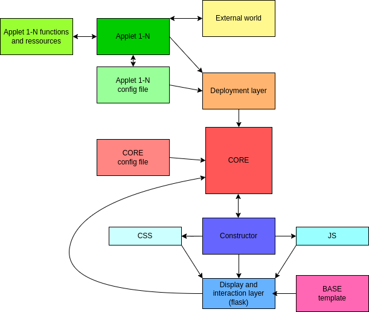

# Sigma Delta Alpha Omega

Sigma Delta Alpha Omega is a highly dynamic & customizable application made with incremental programming, object oriented prgramming & functional programming principles.

## What is incremental programming?

Incremental programming is a computer programming model that organizes software design arround cores and modules. Where the cores can perfecly work without the module and where the software will continue to work without any modification to the cores if a new module is added (assuming that the module respect the cores specification).

## What is object oriented programming?

Object-oriented programming (OOP) is a computer programming model that organizes software design around data, or objects, rather than functions and logic.

## What is functional programming?

Functional programming (FP) is an approach to software development that uses pure functions to create maintainable software.

## Authors

- [@flotchet](https://www.github.com/flotchet)

## Schematic of how the app works

## How to create your applet

First of all you need to create an ini file. This is where you put all the information about your applet. It's very easy to do. Just open up notepad and type in the following:

min_lvl = integer between 0 and 4
max_lvl = integer between 0 and 4 (must be greater or equal than min_lvl)
name = the name of your applet
author = your name
version = the version of your applet
description = a description of your applet
dep0 = the name of the first dependency
dep1 = the name of the second dependency
...
depN = the name of the Nth dependency

Second you need to create a folder in the applets folder. The name of the folder must be the name of your applet with the word ressources at the end
this folder will contain all the python files that are needed for your applet to work.

Third you need to create a python file in the applet folder. This file will contain the code for your applet. It must be named {name of your ini file}.py.

Fourth you need to create to create only one function called {name of your ini file} with these arguments
elem, method, form, args this function must return only the modified elem

elem is all the HTML content that your applet will be displayed in
it also contains the following keys and type:
    head : Markdown         = Markdown(String)
    header : Markdown       = Markdown(String)
    content : Markdown      = Markdown(String)
    side_content : Markdown = Markdown(String)
    search : Markdown       = Markdown(String)
    menu : Markdown         = Markdown(String)
    side_footer : Markdown  = Markdown(String)
    scripts : Markdown      = Markdown(String)

    _attr_lvl : int     = Integer (0-4) MUST NOT BE CHANGED BY YOUR APPLET
    _usr : str          = String MUST NOT BE CHANGED BY YOUR APPLET

Method is the method that is used to call your applet. It can be either 'GET', 'POST', 'PUT', 'DELETE', 'SUPER'.

form is the form that will be attached with the POST method if the method is POST or PUT.

args is a list of arguments that are passed to your applet if needed.
